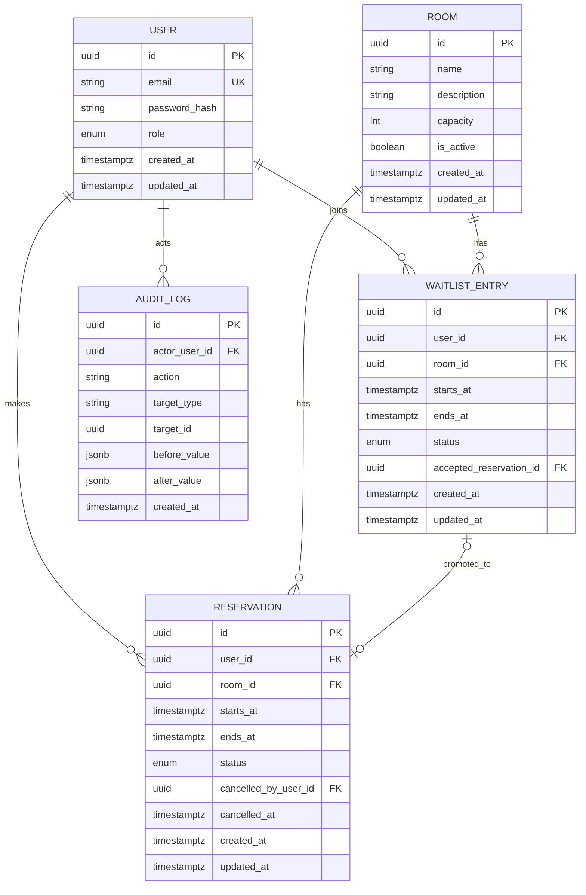

# ERD 초안

## 제약조건 초안

- `ends_at = starts_at + interval '1 hour'`
- 활성 확정 예약에 대한 `(room_id, starts_at)` 부분 unique index
- 활성 대기에 대한 사용자 시간 중복 방지는 exclusion constraint 또는 트랜잭션 검증 후보
- 예약 시간 중복은 PostgreSQL range와 exclusion constraint 사용 여부를 Phase 4~5에서 실험
- `accepted_reservation_id`는 `ACCEPTED` 상태에서만 필수

## 보류된 모델

방별 운영 시간과 예약 가능 일정을 표현할 `RoomSchedule` 또는 `AvailabilityRule`은 Phase 3에서 정책을 확정한 뒤 추가한다.
